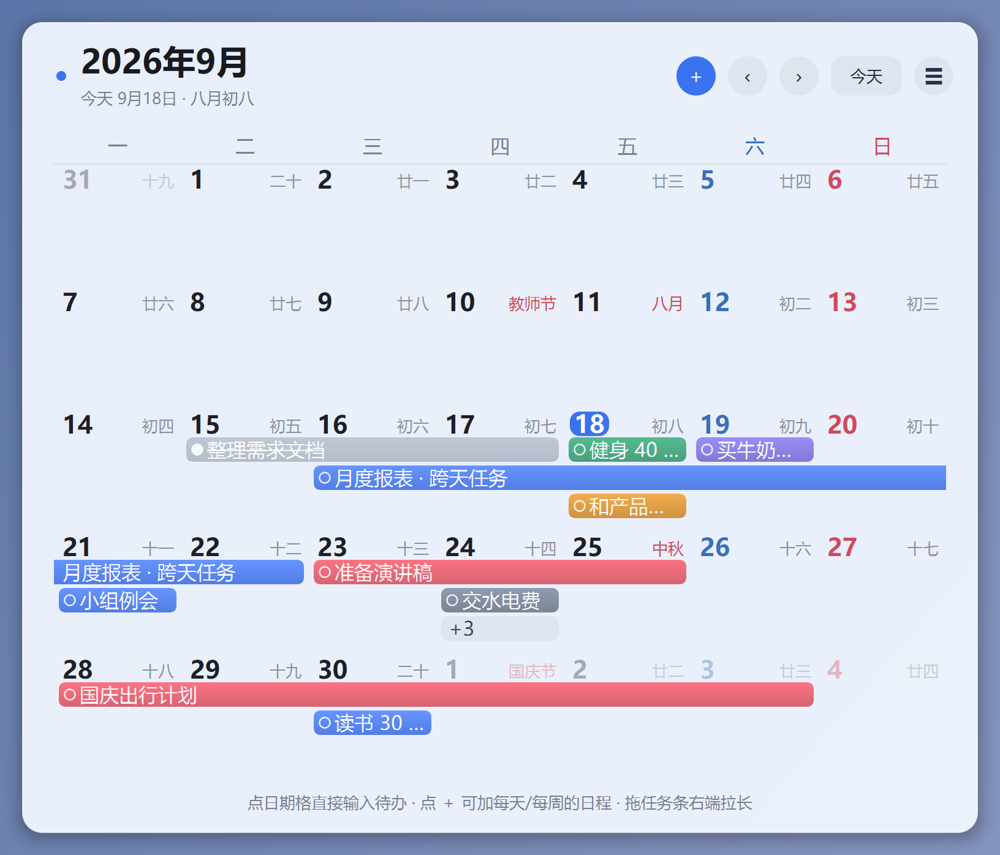
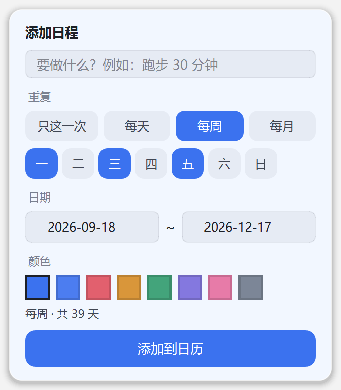
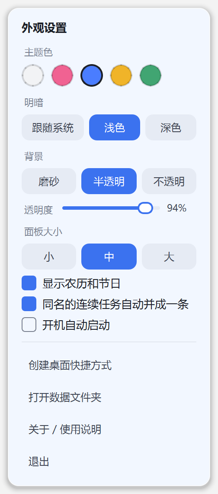

# 桌面月历 DesktopCalendar

一个 Windows 桌面月历小组件：**鼠标滑到屏幕右边缘就出现，移开自动收起**。不占桌面、不挡壁纸，日期格里直接打字就能记待办，任务可以跨天。



## 功能

### 呼出与收起

- 鼠标甩到屏幕**最右边缘**停一下，月历从右侧滑出；鼠标一离开就自动收起
- 右下角托盘常驻小图标，双击也能呼出，右键可以退出
- 收起逻辑分三种情况，不会赖着不走：
  - 输入框是空的 → 鼠标一离开马上收
  - 输入框有字 → 会等你打字；停手几秒且鼠标不在月历上才收，**收之前先把字存好**
  - 打开着添加/编辑面板 → 有操作就不收，闲置几秒自动收（改动即时保存）

### 记日程

- **按天记**：日期格里点一下，直接打字，回车就记上
- **跨天任务**：拖任务条右端往右拉，拉几天就是几天
- **同名自动合并**：同一件事连着几天各写一次，会自动并成一条横条，而不是一堆小方块；中间断开的那天不会硬连
- **固定日程一键加**：点标题右侧的 `+`，支持「每天」「每周一三五」「每月 15 号」这类重复
- 拖任务条中间可以整体挪日期，点左边小圆圈标记完成



### 外观

- 五种主题色：白色 / 粉色 / 蓝色 / 黄色 / 绿色
- 深浅色可切换或跟随系统
- 三种背景：磨砂玻璃（壁纸模糊透出）、半透明、不透明
- 透明度可以拖，面板大小有小 / 中 / 大三档
- 显示农历和节日（春节、中秋、国庆等）



### 数据

- 全部存在本机 `文档\桌面月历\`，**不联网、不注册、不上传**
- 每天自动备份一份，保留最近 30 天
- 想换电脑，直接把那个文件夹拷走

## 下载使用

到本仓库的 **Releases** 页面下载最新版的 zip，解压后双击 `桌面月历.exe` 即可。

不需要装 Python，不需要联网。首次启动时月历会自动滑出来几秒，托盘也会弹一条使用提示。

> 只支持 **Windows 10 / 11**，Mac 和手机用不了。
>
> 注意：解压后整个文件夹都要保留，不能只拿走 exe，旁边的 `_internal` 文件夹是必须的。

## 从源码运行

```bash
git clone https://github.com/<你的用户名>/desktop-calendar.git
cd desktop-calendar

py -3.12 -m venv .venv
.venv\Scripts\python -m pip install -r requirements.txt
.venv\Scripts\python run.py
```

调试用的启动参数：

| 参数 | 作用 |
| --- | --- |
| `--pin` | 固定在屏幕上，不自动收起（方便截图调试） |
| `--show` | 启动后立刻显示一次月历 |
| `--demo-add` | 启动后直接打开「添加日程」面板 |

## 打包成 exe

```powershell
.venv\Scripts\python -m pip install pyinstaller
.venv\Scripts\python -m PyInstaller --noconfirm --clean --windowed `
  --name "桌面月历" --icon "assets\icon.ico" run.py
```

**打包时请把 PATH 收干净**（只留 `C:\Windows\system32` 之类），否则容易踩坑：如果 PATH 里有别的软件自带的 `icuuc.dll`，PyInstaller 会把它打进包里，程序启动时报

```
DLL load failed while importing QtCore: 找不到指定的程序。
```

因为 Qt 在 Windows 上用的是系统 `System32\icuuc.dll`，被打进来的那份版本对不上。

## 项目结构

```
desktop-calendar/
├── run.py                 # 入口：单实例检查、托盘、启动
├── app/
│   ├── app.py             # 控制器：呼出/收起、悬停检测、托盘、主题切换
│   ├── panel.py           # 面板窗口：圆角卡片、阴影、头部
│   ├── grid.py            # 自绘的月历网格：任务条、拖拽、行内输入
│   ├── layout.py          # 任务排版：按周分泳道，算出每条任务的位置
│   ├── store.py           # 任务存储：JSON、自动备份、同名合并
│   ├── popups.py          # 设置面板、添加日程、任务编辑、当天列表
│   ├── theme.py           # 配色：5 种主题色 × 深浅两种模式
│   ├── settings.py        # 用户设置的读写与迁移
│   ├── lunar.py           # 农历与节日
│   ├── winapi.py          # 开机自启、快捷方式、窗口特效
│   ├── paths.py           # 数据目录定位
│   └── qtutil.py          # Qt 小工具
├── tools/make_icon.py     # 生成多尺寸图标
├── assets/                # 图标
└── docs/                  # 截图
```

## 开发中踩过的坑

留在这里，免得以后再踩一遍：

1. **Qt 样式表不会自动重刷子控件。** 如果先创建了子控件、之后再 `setStyleSheet`，子控件仍然用旧样式，换主题时表面上看不出变化。解决办法在 `app/qtutil.py` 的 `apply_stylesheet()`：清空一次样式表，再逐个 `unpolish/polish`。
2. **Windows 自带的 acrylic（毛玻璃）会无视你设的透明度。** `SetWindowCompositionAttribute` 的 tint alpha 在 Win11 上被忽略，面板永远是近乎不透明。现在改成自己抓屏 → 逐级对半缩小再放大做模糊 → 自己叠底色，透明度完全可控。注意一次性大幅缩小会留下马赛克，必须逐级缩。
3. **独立窗口的弹窗挂不上中文输入法。** `Qt.Popup` / `Qt.Tool` 都是独立的 Windows 窗口，有自己的输入上下文，中文输入法默认是英文状态。改成把面板画在主窗口内部的浮层（`QWidget` 子控件），输入法就和主窗口共用了。
4. **子控件再设置样式表要强制重刷。** 同第 1 条，`apply_stylesheet()` 里统一处理。
5. **输入法/焦点类的窗口问题没法用截图验证**，只能靠打印窗口句柄、前台窗口、输入法转换状态来确认。

## 许可证

本项目采用 [MIT](LICENSE) 许可证。

界面基于 **PySide6（LGPL v3）**，农历数据来自 **lunardate（MIT）**。分发打包好的 exe 时，请一并遵守 Qt / PySide6 的 LGPL 条款。

## 说明

个人自用项目，与 Microsoft 没有任何关系，也不代表官方。
